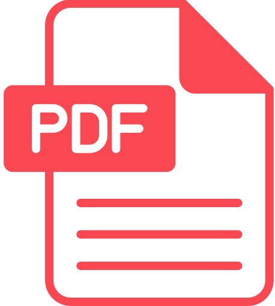

### [Team](stamlab.md) &nbsp;&nbsp;🌴&nbsp;&nbsp; [Publication](publications.md) &nbsp;&nbsp;🌴&nbsp;&nbsp; [Service](services.md) &nbsp;&nbsp;🌴&nbsp;&nbsp; [Teaching](teaching.md)
***

<b>CSCI 412: Mobile Software Engineering</b>  
<b>Syllabus:</b> &nbsp;&nbsp;<a href="https://youtu.be/XfkRyP2y3m0" target="_blank">▶️</a>

👉 Use your NDSU credentials to access the following contents:

| 📅Week                | 📚Chapter                                                                                     | 📁Content                                                                                                                                                                                                   | 
|-----------------------|-----------------------------------------------------------------------------------------------|-------------------------------------------------------------------------------------------------------------------------------------------------------------------------------------------------------------|
| 1st                   | 🔖 Course Overview                                                                            | <a href="https://docs.google.com/presentation/d/1BBqpcGUz5zTM6K5fRzpienib10zik6ceCV7jvo5MkcA/edit?usp=sharing" target="_blank">Slides</a>, <a href="https://youtu.be/XfkRyP2y3m0" target="_blank">Video</a> |
|                       | 🏆 Assignment                                                                                 | <a href="https://docs.google.com/document/d/1NURDHBZo74xQM2mzepLoXcvuNTEtQc_rI-pWOs8hglM/edit?usp=sharing" target="_blank">Assignment-1</a>                                                                 |
| 1st                   | 🔖 Mobile Software Engineering: Opportunities, Needs, and Challenges                          | <a href="https://docs.google.com/presentation/d/1HByiX5SAkvW0vNuwO5rRom-q5-7CanDmRTeBX2ymcFM/edit?usp=sharing" target="_blank">Slides</a>                                                                   |
|                       | 🏆 Assignment                                                                                 | <a href="https://docs.google.com/document/d/1W3pyyvWSyawuWcMLtmuh1rs_RMYwwR97VRSv0JoNsCM/edit?usp=sharing" target="_blank">Assignment-2</a>                                                                 |
| 2nd&nbsp;-&nbsp;4th   | 🔖 Mobile App Development: Native Android Apps - Foundations                                  | <a href="https://docs.google.com/presentation/d/1bORwpmJ4XqRSsdG81rxvFVIEivUfH9aTjZ7fhicer2Q/edit?usp=sharing" target="_blank">Slides</a>                                                                   |
|                       | 🏆 Assignment                                                                                 | <a href="https://docs.google.com/document/d/1GUs9Qftk05WLpHl1pkuLi-pXSRjE-sijBhdwZbnkq5Q/edit?usp=sharing" target="_blank">Assignment-3</a>                                                                 |
| 5th                   | 🔖 Mobile App Development: Native Android Apps - Modern Practices                             | <a href="https://docs.google.com/presentation/d/1DcFj_0GeWkSR6w_xQFZdBZJquyugb7zxh4uXWYTBK2E/edit?usp=sharing" target="_blank">Slides</a>                                                                   |
|                       | 🏆 Assignment                                                                                 | <a href="https://docs.google.com/document/d/1AblRio-KHDrBCZ2T7s3TzDEygi2d1-ZSfKYiZ4DCoQs/edit?usp=sharing" target="_blank">Assignment-4</a>                                                                 |
| 6th&nbsp;-&nbsp;8th   | 🔖 Mobile App Quality: Visual Experience, Stability and Performance, and Privacy and Security | <a href="https://docs.google.com/presentation/d/1rMD7uSYDUhQDJzX0c-EOSjjdaGCVVfbJ099SHTSBLhM/edit?usp=sharing" target="_blank">Slides</a>                                                                   |
|                       | 🏆 Midterm Project                                                                            | <a href="https://docs.google.com/document/d/1bIwxdAI689ojdFD1NphWYqlsOdsKvwWimfN9N_EL8cE/edit?usp=sharing" target="_blank">Midterm Project</a>                                                                 |
| 8th&nbsp;-&nbsp;10th  | 🔖 Mobile App Reliability: Bug Characterization, Prevention, and Detection                    | <a href="https://docs.google.com/presentation/d/1ctTys8p4Ff39gr2Vsj8l9dbIQWvvnmrCt9GEWh_Cb9A/edit?usp=sharing" target="_blank">Slides</a>                                                                   |
|                       | 🏆 Assignment                                                                                 | <a href="https://docs.google.com/document/d/1yBIJhygusHrFG2QcJRPJFDhTZwYv5w38uhwojIUJnTs/edit?usp=sharing" target="_blank">Assignment-5</a>                                                              |
| 11th&nbsp;-&nbsp;13th | 🔖 Mobile App Testing: Strategies, Types, and Techniques                                      | <a href="https://docs.google.com/presentation/d/1Ya-jcgZ_WlaSmCTMzSJe42biaSaIxurleomHXKh-FJ4/edit?usp=sharing" target="_blank">Slides</a>                                                                   |
|                       | 🏆 Assignment                                                                                 | <a href="https://docs.google.com/document/d/1puNGLJ0yU307TZm1xted46_TQVtJYf1PgK9EWllVEn8/edit?usp=sharing" target="_blank">Assignment-6</a>                                                                 |
| 13th&nbsp;-&nbsp;15th | 🔖 Mobile App Security: Vulnerabilities Prevention and Detection                              | <a href="https://docs.google.com/presentation/d/1NGNzAIHzMQ0Njyq0cNqwgA1sIuOAh3VVylYhDZ2Y9H8/edit?usp=sharing" target="_blank">Slides</a>                                                                   |
|                       | 🏆 Assignment                                                                                 | <a href="https://docs.google.com/document/d/1sHDPdMzaRTPOUqgg8bJHSPTkmt6Ey3X_7lG83yf_4pY/edit?usp=sharing" target="_blank">Assignment-7</a>                                                                 |
| 16th                  | 🏆 Final Project Presentation                                                                 | <a href="https://docs.google.com/document/d/1LG6y3Sodl2F2rChTg2Cq2kQGLcba41Pls-76AQ0p968/edit?usp=sharing" target="_blank">Final Project</a>                                                                |

