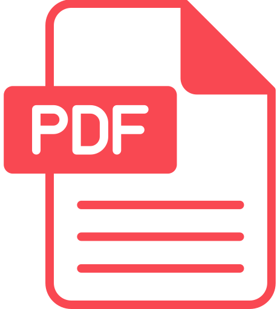

### [Team](stamlab.md) &nbsp;&nbsp;🌴&nbsp;&nbsp; [Publication](publications.md) &nbsp;&nbsp;🌴&nbsp;&nbsp; [Service](services.md) &nbsp;&nbsp;🌴&nbsp;&nbsp; [Teaching](teaching.md)
***

<b>CSCI 713: Software Development Processes</b>  
<b>Syllabus: </b> 

👉 Use your NDSU credentials to access the following contents:

| 📅Week      | 📚Chapter                             | 📁Content                                                                                                                                 | 
|-------------|---------------------------------------|-------------------------------------------------------------------------------------------------------------------------------------------|
| 1st         | 🔖 Course Overview                    | <a href="https://docs.google.com/presentation/d/1UIrjQ6yi5ytBJATXIjBz4rrx4p9TMpu-cjUzvg-jzFU/edit?usp=sharing" target="_blank">Slides</a> |
| 1st & 2nd   | 🔖 Software Development Processes     | <a href="https://docs.google.com/presentation/d/1xmyOZ0OL-KlCqQTVQGVrmrPxFsoqG4HfLqyupNkMmoQ/edit?usp=sharing" target="_blank">Slides</a> |
| 2nd & 3rd   | 🔖 Project Initiation and Planning    | <a href="https://docs.google.com/presentation/d/1O3vJXh2sZequb0sPPb8fLDvoYdnBtJjVMkkbo7ZFVxU/edit?usp=sharing" target="_blank">Slides</a> |
|             | 🏆 Assignment                         | <a href="https://docs.google.com/document/d/13UyyI88Wv_f6qSsLirgPhHzEf0I-x4AbjXJQfnhpKfo/edit?usp=sharing" target="_blank">Assign-1</a>   |
| 4th & 5th   | 🔖 Plan-driven Software Development   | <a href="https://docs.google.com/presentation/d/1Zs-t5Nx76M8NLe6C9Y4WsS4TG0vKAPQFICgM91hMEJ8/edit?usp=sharing" target="_blank">Slides</a> |
| 5th & 6th   | 🔖 Agile Software Development         | <a href="https://docs.google.com/presentation/d/1ZBm9-Xv9yAi_3A4urGVE8rPu0vPEgs4eslYd2i-buGE/edit?usp=sharing" target="_blank">Slides</a> |
|             | 🏆 Assignment                         | <a href="https://docs.google.com/document/d/1SS7TylUzCdWzeD-bJ3L2bJbYnhgTCXQXoC_Une4jaq4/edit?usp=sharing" target="_blank">Assign-2</a>   |
| 7th & 8th   | 🔖 DevOps Software Development        | <a href="https://docs.google.com/presentation/d/180I6UlddapXlS3OZoGpp9XQfyTEmkZlnxlzEKL-j3Pk/edit?usp=sharing" target="_blank">Slides</a> |
|             | 🏆 Assignment                         | <a href="https://docs.google.com/document/d/10RDqB_cDXBDRXBktjIgtQ10PridGrLAvkyWMhSLs5lI/edit?usp=sharing" target="_blank">Assign-3</a>   |
| 8th & 9th   | 🔖 Requirement Engineering            | <a href="https://docs.google.com/presentation/d/1esOgA08ofgrn5V-SFdgiKlFTlTA_KPMjcEaN_c_iTjA/edit?usp=sharing" target="_blank">Slides</a> |
|             | 🏆 Assignment                         | <a href="https://docs.google.com/document/d/10eKzSCJpxqi7GxXCZ_D3F7rvQTtVAH_MeBw536O15Co/edit?usp=sharing" target="_blank">Assign-4</a>   |
| 9th & 10th  | 🔖 Software Design                    | <a href="https://docs.google.com/presentation/d/1j73GbP0KFYgxuOuQhJ_TrmZ401dMHu3NYIvClVXCeig/edit?usp=sharing" target="_blank">Slides</a> |
|             | 🏆 Assignment                         | <a href="https://docs.google.com/document/d/1WVDhB55g1-X441JLlDPBgAdonYLAw6spNB-wTVufH7Y/edit?usp=sharing" target="_blank">Assign-5</a>   |
| 11th & 12th | 🔖 Software Construction              | <a href="https://docs.google.com/presentation/d/1El8T5HPud33vWPrVDlSDHwC344QgmPj5C9JbBCA-yqc/edit?usp=sharing" target="_blank">Slides</a> |
|             | 🏆 Assignment                         | <a href="https://docs.google.com/document/d/1EQGigxm6jBfxWaXLQGdgUSqaDHQsw47-nlE8ljsJO88/edit?usp=sharing" target="_blank">Assign-6</a>   |
| 13th & 14th | 🔖 Software Testing                   | <a href="https://docs.google.com/presentation/d/1i9QKkItVgQHgingR-07Vpq3PS8b3PVOnUeReCPo5xh0/edit?usp=sharing" target="_blank">Slides</a> |
|             | 🏆 Assignment                         | Assign-7                                                                                                                                  |
| 14th & 15th | 🔖 Software Maintenance and Evolution | Slides                                                                                                                                    |

