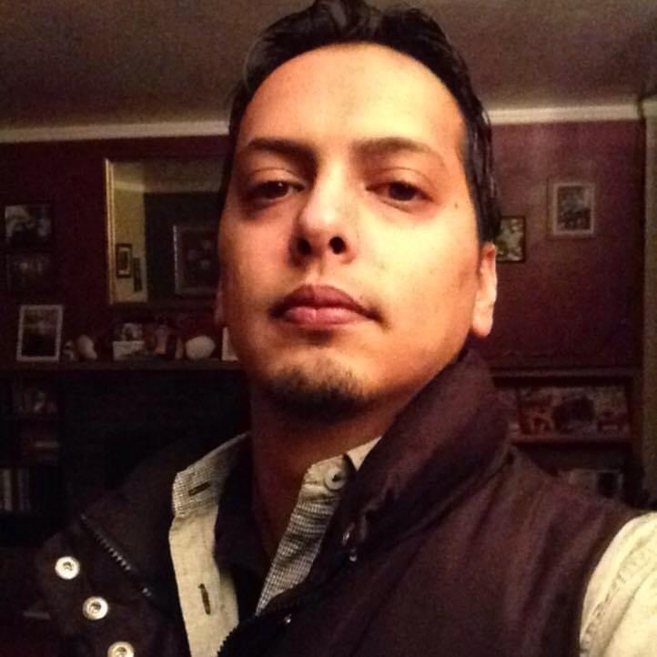
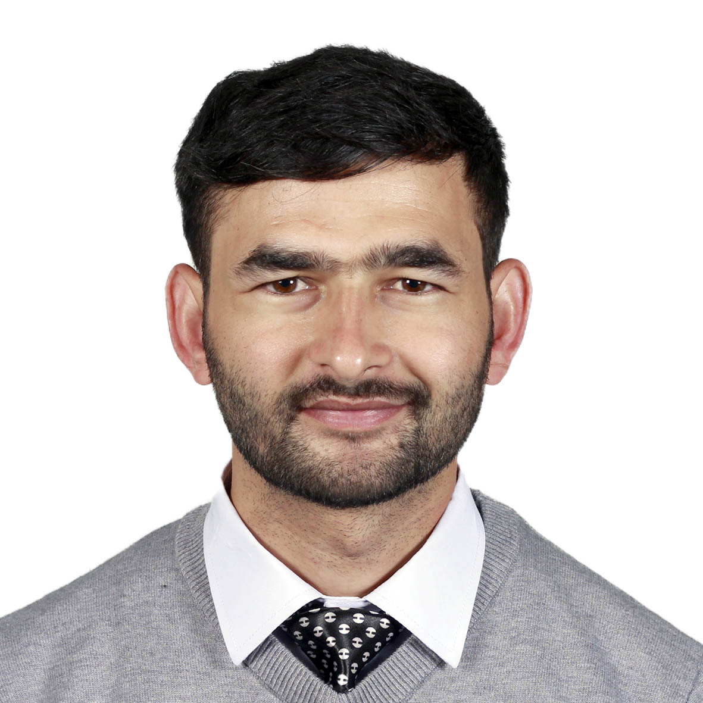

### [Students](stamlab.md) &nbsp;&nbsp;🌴&nbsp;&nbsp; [Publication](publications.md) &nbsp;&nbsp;🌴&nbsp;&nbsp; [Service](services.md) &nbsp;&nbsp;🌴&nbsp;&nbsp; [Teaching](teaching.md)
***

<b> The Software Testing And Maintenance (STAM) Lab</b>

<h4>‍🎓 Current Students</h4>
&nbsp;&nbsp;&nbsp;&nbsp;&nbsp;&nbsp;&nbsp;&nbsp;&nbsp;&nbsp;&nbsp;&nbsp;&nbsp;&nbsp;&nbsp;&nbsp;&nbsp; 
&nbsp;&nbsp;&nbsp;&nbsp;<a href="https://www.amj.dev/" target="_blank">Amjad Allobadi, PhD</a>&nbsp;&nbsp;&nbsp;&nbsp;&nbsp;&nbsp;&nbsp;&nbsp;&nbsp;&nbsp;&nbsp;<a href="https://bhattasuraj76.com.np/" target="_blank">Suraj Bhatta, MS</a>

<h4>‍🎓 Students co-supervised at the University of Alberta</h4>
- Masters&nbsp;&nbsp;&nbsp;&nbsp;&nbsp;<b>Mansur Gulami</b> (Feb 2022 - July 2022)
- Ph.D.&nbsp;&nbsp;&nbsp;&nbsp;&nbsp;&nbsp;&nbsp;&nbsp;&nbsp;&nbsp;<b>Mohayeminul Islam</b> (Oct 2021 - current)
- Ugrad RA&nbsp;&nbsp;&nbsp;<b>Xichen Pan</b> (May 2021 – Sep 2021)
- Masters&nbsp;&nbsp;&nbsp;&nbsp;&nbsp;&nbsp;<b>Batyr Nuryyev</b> (July 2020 – Nov 2021)

